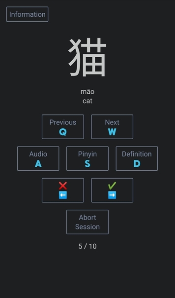

 
 

## Overview 📝

Mooncake Chinese is an web based single page application used for learning simplified Chinese characters.

## Features ✨

Users can choose one of the following flashcard selection algorithms for their study session.

- `new` new words only
- `known` known words only
- `equally_mixed` half new words and half known words

Study sessions also support the following parameters.

- `size`
  - description: the number of characters to return
  - default: `10`
  - required: False
  - supported values:
      - 1 to 4993
- `hsk`
  - description: the hsk level to filter by
  - default: `1`
  - required: False
  - supported values:
      - 1 to 6

With any algorithm or set of parameters, users can decide if they want to submit stats to the database by navigating with [⬅️/❌][✔️/➡️], or pass on the submission of stats by navigating with [Pervious/🇶][🇼/Next].

## Development Mode 🖥️

1. $~/learn_chinese_app/server> `pip install -r requirements.txt`

2. $~/learn_chinese_app/vue> `npm install`

3. Run `start_development.bat`

## Production Mode 😊

1. After development mode has been set up at least once, you can run `start_production.bat`.
  - Note: The Flask server is not meant for a real production environment.

## Other 💫

- You will require a sqlite3.dll above version 3.24.0 so that `UPSERT` transactions are supported. You can download a new version from https://www.sqlite.org/download.html. Copy and replace it at path `C:/Users/<USERNAME>/AppData/Local/Programs/Python/Python<PYTHON_VERSION>/DLLs/sqlite3.dll`.
- You can download the vocabulary `.mp3s` from `https://github.com/skwzrd/mooncake/releases` and extract them to `~/audio/vocabulary`. 
